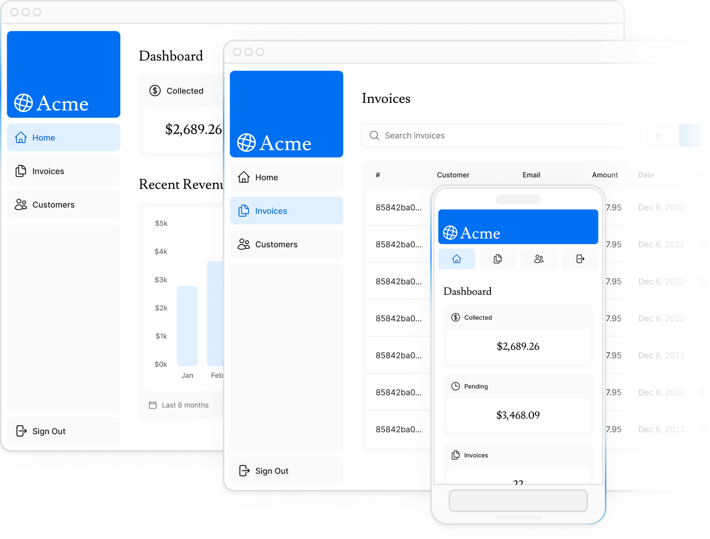

<a name="readme-top"></a>

<div align="center">
  

  <br/>
</div>

# 📗 Table of Contents

- [📖 About the Project](#about-project)
  - [🛠 Built With](#built-with)
    - [Tech Stack](#tech-stack)
    - [Key Features](#key-features)
  - [🚀 Live Demo](#live-demo)
- [💻 Getting Started](#getting-started)
  - [Setup](#setup)
  - [Install](#install)
  - [Usage](#usage)
  - [Login](#login)
- [👥 Authors](#authors)
- [🔭 Future Features](#future-features)
- [🤝 Contributing](#contributing)
- [⭐️ Show your support](#support)
- [📝 License](#license)

# 📖 Financial Dashboard<a name="about-project"></a>

A full-stack financial dashboard built with Next.js. Features authentication, invoice management, and a PostgreSQL database. Built as part of the Next.js Foundations course.

## 🛠 Built With <a name="built-with"></a>

### Tech Stack <a name="tech-stack"></a>

  <ul>
  <li><a href="https://nextjs.org/docs">Next.js</a></a></li>
    <li><a href="https://reactjs.org/">React.js</a></li>
    <li><a href="https://www.typescriptlang.org/">TypeScript</a></li>
    <li><a href="https://tailwindcss.com/">Tailwind CSS</a></li>
    <li><a href="https://www.postgresql.org/">PostgreSQL</a></li>
    <li><a href="https://next-auth.js.org/">NextAuth.js</a></li>
  </ul>

### Key Features <a name="key-features"></a>

- **✅ Public homepage & secure login**
- **✅ CRUD operations for invoices**
- **✅ PostgreSQL database (Vercel-hosted)**
- **✅ Styled with CSS Modules/Tailwind**
- **✅ Built with Next.js App Router**

<p align="right">(<a href="#readme-top">back to top</a>)</p>

## 🚀 Live Demo <a name="live-demo"></a>

- [Live Demo Link](https://nextjs-dashboard-two-phi-37.vercel.app/)

<p align="right">(<a href="#readme-top">back to top</a>)</p>

## 💻 Getting Started <a name="getting-started"></a>

To get a local copy up and running, follow these steps.

### Setup

Clone this repository to your desired folder:

```sh
  git clone git@github.com:codehass/nextjs-dashboard.git
```

### Install

Install this project with:

```sh
  cd nextjs-dashboard
  pnpm install
```

### Usage

To run the project, execute the following command:

```sh
  pnpm run dev
```

### Login

```sh
  email: user@nextmail.com
  password: 123456
```

<p align="right">(<a href="#readme-top">back to top</a>)</p>

## 👥 Author <a name="authors"></a>

👤 **Hassan El Ouardy**

- GitHub: [@codehass](https://github.com/codehass)
- Twitter: [@hassanelourdy](https://twitter.com/hassanelourdy)
- LinkedIn: [@hassanelourdy](https://www.linkedin.com/in/hassanelouardy/)

<p align="right">(<a href="#readme-top">back to top</a>)</p>

## 🔭 Future Features <a name="future-features"></a>

1- **Advanced Analytics**:
  - Charts/graphs (using D3.js or Chart.js) for spending trends.
  - Export data to CSV/PDF.

2- **User Roles**:
  - Admin vs. user permissions (e.g., view-only vs. edit).

3- **Multi-currency Support**:
  - Automatic currency conversion via API.

4- **Notifications**:
  - Email/SMS alerts for overdue invoices.

5- **Dark Mode**:
  - Toggleable UI theme.

<p align="right">(<a href="#readme-top">back to top</a>)</p>

## 🤝 Contributing <a name="contributing"></a>

Contributions, issues, and feature requests are welcome!

Feel free to check the [issues page](https://github.com/codehass/nextjs-dashboard/issues).

<p align="right">(<a href="#readme-top">back to top</a>)</p>

## ⭐️ Show your support <a name="support"></a>

Join us in supporting our project to improve cabin management in hotels! Your help makes a big difference in making stays smoother and guests happier. Let's work together to bring positive change to the hospitality industry!

<p align="right">(<a href="#readme-top">back to top</a>)</p>

## 📝 License <a name="license"></a>

This project is [MIT](./MIT.md) licensed.

<p align="right">(<a href="#readme-top">back to top</a>)</p>
